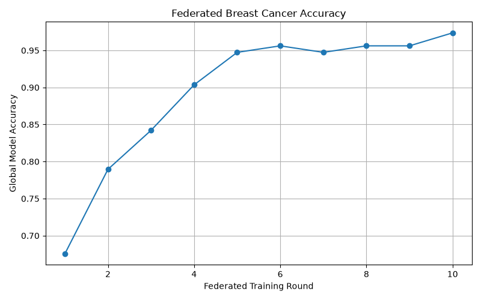
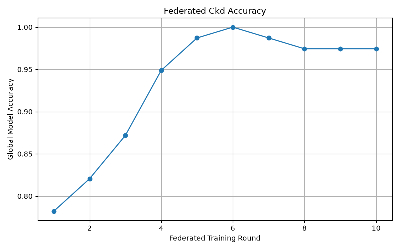
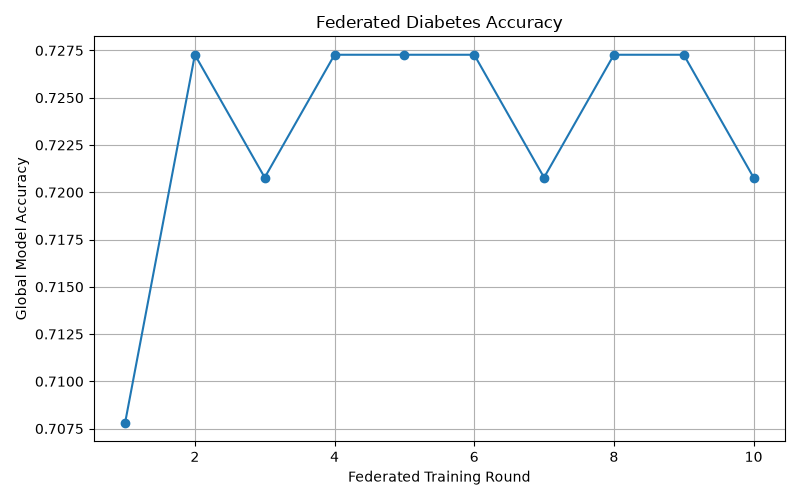
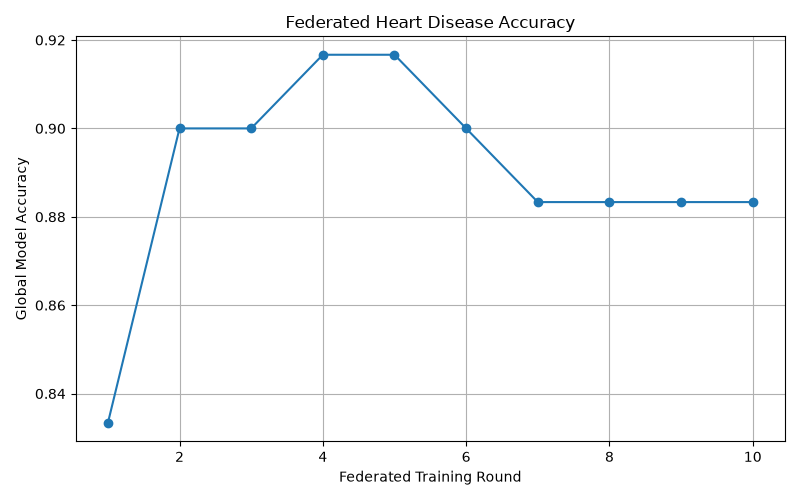

# FEDERATED HEALTHCARE DIAGNOSIS 

> **A unified Federated Learning and healthcare analytics platform for multi-disease prediction using PyTorch, Flower, and FastAPI.**

---

## Overview

The **Federated Healthcare Diagnosis System** is a research-oriented machine-learning platform that explores the application of **Federated Learning (FL)** to healthcare disease prediction across multiple heterogeneous datasets.

Instead of combining all training records into a single centralized dataset, the system uses a distributed training workflow in which simulated healthcare clients train disease-specific models locally. Model parameters are communicated to a central **Flower federated server**, where client updates are aggregated using **Federated Averaging (FedAvg)**.

The platform currently supports four healthcare prediction tasks:

- **Chronic Kidney Disease (CKD)**
- **Diabetes**
- **Heart Disease**
- **Breast Cancer**

The project has evolved from separate disease-specific implementations into a unified architecture containing:

- Disease-specific PyTorch models
- Disease-specific preprocessing pipelines
- Centralized disease registry
- Unified federated client and server
- Flower-based Federated Learning
- Federated Averaging
- Model evaluation utilities
- Accuracy visualization
- Research analytics
- Result-generation utilities
- FastAPI application layer

> **Disclaimer:** This is an educational and research prototype. It is not a clinical diagnostic system or medical device. Experimental results must not be interpreted as clinical validation.

---

# Motivation

Healthcare machine-learning applications may involve sensitive patient information distributed across hospitals, clinics, laboratories, or other institutions.

A conventional centralized workflow can be represented as:

Hospital / Client A ─┐
Hospital / Client B ─┤
Hospital / Client C ─┼──► Central Dataset ──► ML Model
Hospital / Client D ─┘

Federated Learning provides an alternative distributed training paradigm:

                    ┌─────────────────────┐
                    │  Federated Server   │
                    │    Flower / FedAvg  │
                    └──────────┬──────────┘
                               │
                         Model Updates
                               │
             ┌─────────────────┼─────────────────┐
             ▼                 ▼                 ▼
       ┌──────────┐      ┌──────────┐      ┌──────────┐
       │ Client 1 │      │ Client 2 │      │ Client N │
       │ Local ML │      │ Local ML │      │ Local ML │
       │   Data   │      │   Data   │      │   Data   │
       └──────────┘      └──────────┘      └──────────┘

Each client performs local training while the federated server aggregates model updates into a global model.

The objective of this project is to demonstrate how this distributed training paradigm can be applied across multiple healthcare prediction tasks while maintaining a reusable and extensible software architecture.

---

# Key Features

## **1. Federated Learning**

* Flower-based Federated Learning
* Federated Averaging (FedAvg)
* Distributed client-side training
* Multi-round model aggregation
* Global model evaluation
* Local model training
* Model parameter exchange

---

## **2. Multi-Disease Prediction**

The platform currently supports:

| Disease                    | Task                  |
| -------------------------- | --------------------- |
| **Chronic Kidney Disease** | Binary Classification |
| **Diabetes**               | Binary Classification |
| **Heart Disease**          | Binary Classification |
| **Breast Cancer**          | Binary Classification |

Each disease has its own preprocessing pipeline and neural-network architecture because the underlying datasets contain different feature spaces and data representations.

---

## **3. Unified Architecture**

A centralized **Disease Registry** maps each disease to its corresponding:

* Dataset loader
* Preprocessing pipeline
* Neural-network model
* Model utilities
* Evaluation workflow

This allows the federated infrastructure to remain reusable rather than requiring an independent client/server implementation for every disease.

Selected Disease
       │
       ▼
Disease Registry
       │
       ├──────────────► Data Pipeline
       │
       └──────────────► PyTorch Model
                              │
                              ▼
                       Federated Client
                              │
                              ▼
                       Flower Server

## **4. Healthcare Analytics**

The project contains a dedicated analytics layer supporting research-oriented analysis such as:

* Dataset characterization
* Disease-wise analysis
* Federated accuracy visualization
* Result generation
* Comparison tables
* Correlation analysis
* Research result storage

---

## **5. FastAPI Application Layer**

The project also includes a **FastAPI-based application layer** for exposing healthcare prediction functionality through HTTP endpoints and interactive API documentation.

The API layer provides a foundation for integrating the machine-learning system with future dashboards, databases, or frontend applications.

---

# System Architecture

                         FEDERATED HEALTHCARE
                                  │
                                  ▼
                         ┌─────────────────┐
                         │ Disease Registry│
                         └────────┬────────┘
                                  │
             ┌────────────────────┼────────────────────┐
             ▼                    ▼                    ▼
        CKD Pipeline        Diabetes Pipeline    Heart Pipeline
             │                    │                    │
             └────────────────────┼────────────────────┘
                                  │
                         Disease-specific
                         PyTorch Models
                                  │
                                  ▼
                         Federated Clients
                                  │
                           Local Training
                                  │
                                  ▼
                         Flower FL Server
                                  │
                                FedAvg
                                  │
                                  ▼
                           Global Model
                                  │
                 ┌────────────────┴────────────────┐
                 ▼                                 ▼
            Evaluation                         Analytics
                 │                                 │
                 ▼                                 ▼
          Accuracy Graphs                  Tables / Correlations
                                                   │
                                                   ▼
                                            FastAPI Layer

---

# Machine Learning Architecture
Each disease uses a dedicated neural-network architecture because the datasets have different feature counts and preprocessing requirements.

## **Chronic Kidney Disease Model**
24 Input Features
        ↓
32 Neurons
        ↓
16 Neurons
        ↓
1 Sigmoid Output

## **Diabetes Model**
8 Input Features
       ↓
16 Neurons
       ↓
12 Neurons
       ↓
1 Sigmoid Output

## **Heart Disease Model**
13 Input Features
        ↓
16 Neurons
        ↓
12 Neurons
        ↓
1 Sigmoid Output

## **Breast Cancer Model**
30 Input Features
        ↓
32 Neurons
        ↓
16 Neurons
        ↓
1 Sigmoid Output

### **Activation Functions**

* Hidden layers: **ReLU**
* Output layer: **Sigmoid**
* Task: **Binary Classification**

---

# Federated Training Workflow
The current federated workflow follows this process:

1. Select Disease
        ↓
2. Disease Registry
        ↓
3. Load Dataset
        ↓
4. Disease-specific Preprocessing
        ↓
5. Train/Test Split
        ↓
6. Partition Training Data
        ↓
7. Initialize Local Client Models
        ↓
8. Local Training
        ↓
9. Send Model Parameters
        ↓
10. Flower Federated Server
        ↓
11. Federated Averaging (FedAvg)
        ↓
12. Generate Global Model
        ↓
13. Redistribute Parameters
        ↓
14. Next Federated Round
        ↓
15. Global Evaluation
        ↓
16. Generate Results and Graphs

---

# Current Experimental Configuration
The demonstrated federated experiments use:

| Configuration                |          Value |
| ---------------------------- | -------------: |
| Disease Tasks                |          **4** |
| Simulated Clients            |          **2** |
| Federated Rounds             |         **10** |
| Classification               |     **Binary** |
| Aggregation Strategy         |     **FedAvg** |
| Deep Learning Framework      |    **PyTorch** |
| Federated Learning Framework |     **Flower** |
| Visualization                | **Matplotlib** |

---

# Experimental Results
The current documented prototype experiments produced the following final observed global accuracies:

| Disease                    | Final Observed Global Accuracy |
| -------------------------- | -----------------------------: |
| **Chronic Kidney Disease** |                     **~97.4%** |
| **Breast Cancer**          |                     **~97.4%** |
| **Heart Disease**          |                     **~80.0%** |
| **Diabetes**               |                     **~74.7%** |

### **Important Interpretation**

These values represent **observed prototype results** from the demonstrated federated configuration.

They should not be interpreted as:

* Clinical validation
* Production performance
* State-of-the-art performance
* Medical safety evidence
* Generalization to real-world hospital populations

More rigorous evaluation requires repeated experiments, multiple random seeds, stronger baselines, additional medical metrics, and controlled data-distribution experiments.

---

# Training Visualizations
The repository contains generated federated-learning accuracy curves for all four disease models.

## **Breast Cancer**

## **Chronic Kidney Disease**

## **Diabetes**

## **Heart Disease**

---

# Project Structure:
Federated_Healthcare_Diagnosis_System/
│
├── ANALYTICS/
│   ├── __init__.py
│   ├── disease_correlation.py
│   ├── generate_all.py
│   └── results_store.py
│
├── DATASETS/
│   ├── breast_cancer.csv
│   ├── ckd.csv
│   ├── diabetes.csv
│   └── heart.csv
│
├── GRAPHS/
│   ├── breast_cancer_accuracy.png
│   ├── ckd_accuracy.png
│   ├── diabetes_accuracy.png
│   └── heart_disease_accuracy.png
│
├── MODELS/
│   ├── __init__.py
│   ├── breastcancer_model.py
│   ├── ckd_model.py
│   ├── diabetes_model.py
│   └── heartdisease_model.py
│
├── RESULTS/
│   └── tables/
│       ├── dataset_characteristics.csv
│       └── disease_correlation_limitation.md
│
├── UTILS/
│   ├── __init__.py
│   ├── breastcancer_utils.py
│   ├── ckd_utils.py
│   ├── diabetes_utils.py
│   ├── evaluation_metrics.py
│   ├── heartdisease_utils.py
│   ├── model_factory.py
│   ├── model_loader.py
│   ├── model_saver.py
│   ├── model_utils.py
│   └── preprocessing.py
│
├── app/
│   ├── schemas/
│   ├── __init__.py
│   ├── heart.py
│   └── main.py
│
├── trained_models/
│   ├── diabetes.pth
│   └── heart_disease.pth
│
├── analytics.py
├── client_unified.py
├── disease_registry.py
├── launcher.py
├── server_unified.py
├── requirements.txt
├── .gitignore
├── LICENSE
└── README.md

---

# Component Overview

## **`disease_registry.py`**
Provides the central mapping between supported diseases, their models, and their corresponding data-processing pipelines.

Disease
   │
   ├── Model
   │
   └── Data Pipeline

This keeps disease selection and configuration centralized.

---

## **`client_unified.py`**
Implements the common federated client workflow, including:

* Local dataset loading
* Model initialization
* Parameter exchange
* Local training
* Local evaluation

---

## **`server_unified.py`**
Coordinates the federated-learning process through Flower, including:

* Server initialization
* Federated rounds
* Client aggregation
* Global model handling
* Result tracking
* Accuracy visualization

---

## **`launcher.py`**
Provides a common entry point for executing the federated system.

---

## **`MODELS/`**

Contains the disease-specific PyTorch neural-network architectures.

---

## **`UTILS/`**

Contains reusable utilities for:

* Data preprocessing
* Dataset preparation
* Model creation
* Model loading
* Model saving
* Evaluation
* Feature processing

---

## **`ANALYTICS/`**

Contains research analytics functionality for:

* Disease analysis
* Correlation analysis
* Result generation
* Result storage

---

## **`RESULTS/`**

Contains generated research-oriented outputs such as:

* Dataset characteristics
* Analytical documentation
* Correlation-related methodological notes

---

## **`app/`**

Contains the FastAPI application layer and API schemas/endpoints used to expose prediction functionality.

---

## **`trained_models/`**

Contains selected trained model artifacts used by the application layer.

---

# Technology Stack

## **Programming**:
* Python

## **Machine Learning**:
* PyTorch
* scikit-learn
* Pandas
* NumPy

## **Federated Learning**:
* Flower
* Federated Averaging (FedAvg)

## **Backend / API**:
* FastAPI

## **Visualization**:
* Matplotlib

## **Development**:
* VS Code
* Git
* GitHub

---

# Data Processing
The four healthcare datasets are heterogeneous and therefore use disease-specific preprocessing pipelines.
Typical preprocessing operations include:

* Feature/target separation
* Missing-value handling
* Numerical conversion
* Categorical encoding
* Feature standardization
* Train/test splitting
* Client data partitioning
* PyTorch tensor conversion
* DataLoader construction

Disease-specific preprocessing is maintained separately because the four datasets do not share the same feature space or data representation.

---

# Disease Correlation Consideration

A key methodological consideration of this project is the distinction between **dataset-level comparison** and **patient-level disease correlation**.
The four primary disease datasets represent separate patient populations.
Therefore, directly correlating rows from:

Heart Dataset
      ↕
Diabetes Dataset

does **not** establish a patient-level relationship because corresponding rows do not represent the same patients.
A scientifically valid multimorbidity analysis requires a dataset where multiple disease indicators are recorded for the same patients.
This distinction is intentionally documented to avoid unsupported medical conclusions.

---

# Privacy and Security Positioning

Federated Learning is used in this project because it provides a distributed training paradigm in which raw training records do not need to be transferred to a central training dataset during the demonstrated federated workflow.

However, the current implementation should **not** be described as providing formal privacy guarantees.

The current project does not implement:

* Cryptographic secure aggregation
* Differential privacy
* Formal privacy accounting
* Comprehensive privacy threat modeling

These are future research directions.

---

# Current Limitations

The current system is a research and engineering prototype.
Current limitations include:

* Simulated rather than real institutional clients
* Limited demonstrated client count
* Limited federated rounds
* Public healthcare datasets
* Accuracy-focused baseline evaluation
* No external clinical validation
* No prospective patient evaluation
* No formal calibration analysis
* No cryptographic secure aggregation
* No formal differential privacy mechanism
* No clinical deployment

These limitations should be considered when interpreting experimental results.

---

# Future Development

**Planned improvements include:**
* Precision
* Recall / Sensitivity
* Specificity
* F1-score
* ROC-AUC
* PR-AUC
* Confusion matrices
* Calibration analysis

---

**Future experiments can investigate:**
* Multiple random seeds
* Centralized baseline
* Local-only baseline
* IID vs non-IID settings
* Label skew
* Feature distribution shift
* Client imbalance
* Communication overhead
* Convergence behavior

---

**Future privacy-oriented research can include:**
* Secure aggregation
* Differential privacy
* Privacy/utility analysis
* Threat-model evaluation

---

**Future analytics extensions include:**
* Client-level performance comparison
* Disease-wise comparison
* Multimorbidity analysis
* Validated disease correlation analysis
* Expanded research dashboards
* Additional statistical analysis

---

**Potential backend extensions include:**
* Additional FastAPI endpoints
* Database integration
* Persistent experiment storage
* Authentication and authorization
* API-based analytics
* Frontend dashboard integration

---

# Reproducibility
**Future experimental runs should record:**

* Python version
* Package versions
* Operating system
* Hardware
* Dataset version
* Random seed
* Number of clients
* Number of federated rounds
* Local epochs
* Batch size
* Learning rate
* Optimizer
* Aggregation strategy
* Evaluation metrics

Maintaining these records allows experiments to be reproduced and compared reliably.

---

# Research Positioning
The strongest current positioning of this project is:

> **A unified multi-disease Federated Learning and healthcare analytics prototype for heterogeneous medical prediction tasks.**

The project demonstrates the integration of:

Machine Learning
       +
Deep Learning
       +
Federated Learning
       +
Distributed Training
       +
Healthcare Analytics
       +
API Development

---

# Project Status

## **Active Research & Development**

### **Implemented**

* Four disease prediction models
* Disease-specific preprocessing
* Unified disease registry
* Unified federated client
* Unified federated server
* Flower-based Federated Learning
* FedAvg aggregation
* Multi-round federated training
* Accuracy visualization
* Analytics module
* Result-generation utilities
* FastAPI application layer
* Project launcher
* Trained model artifacts
* Git/GitHub repository
* Project documentation

### **Planned / Research Extensions**

* Multi-seed evaluation
* Centralized and local-only baselines
* Non-IID experiments
* Expanded medical metrics
* Secure aggregation
* Differential privacy
* Extended analytics dashboard
* Database-backed experiment storage
* Clinical/external validation

---

# Disclaimer

This project is intended for **educational, research, and software-engineering purposes**.
It is **not a medical device** and should not be used to diagnose, treat, or make clinical decisions about patients.
Experimental results presented in this repository do not establish clinical effectiveness, safety, or generalization to real-world healthcare populations.

---

# License

This project is licensed under the **MIT License**.
See [`LICENSE`](LICENSE) for details.

---

# Project Summary

**Federated Healthcare Diagnosis System** combines machine learning, deep learning, federated learning, healthcare analytics, and API development into a unified research-oriented platform.

### **Core Technologies**
`Python` · `PyTorch` · `Flower` · `FastAPI` · `scikit-learn` · `Pandas` · `NumPy` · `Matplotlib`

### **Core Concepts**
`Federated Learning` · `FedAvg` · `Distributed Training` · `Neural Networks` · `Healthcare AI` · `Data Preprocessing` · `Model Evaluation` · `Healthcare Analytics` · `API Development`

### **Current Demonstration**
4 disease tasks · 2 simulated clients · 10 federated rounds · disease-specific neural networks · automated evaluation and visualization

---

